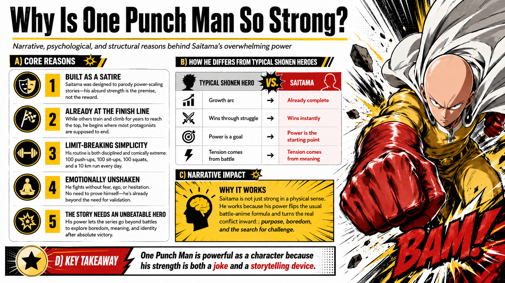
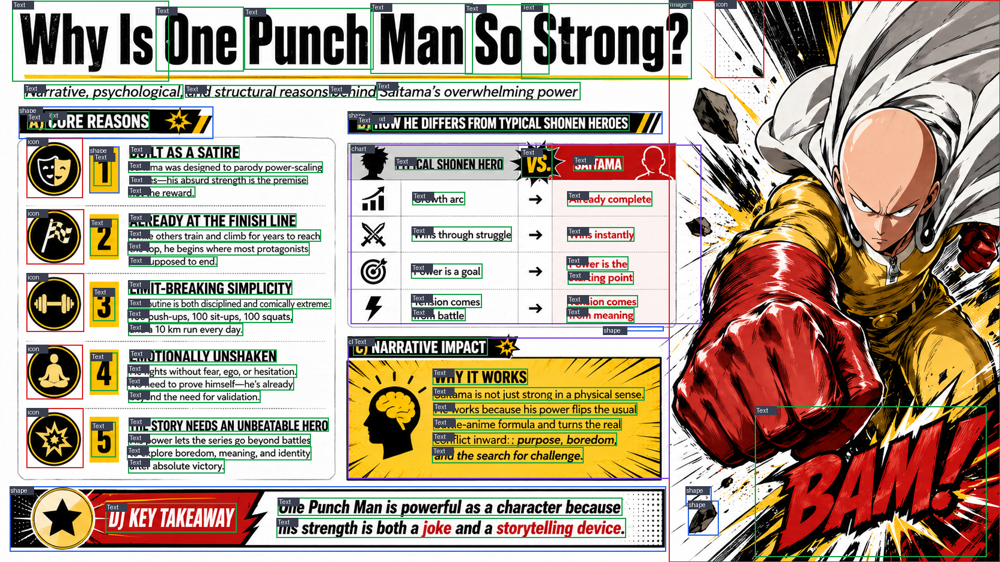
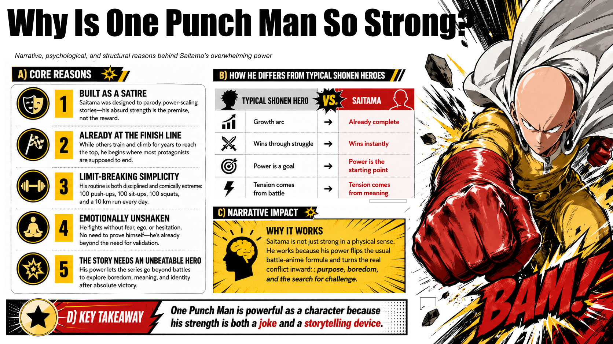

# Image to PPT

Convert slide images into editable PowerPoint presentations.

Nanobanana, Duct Tape 같은 이미지 생성 모델이 만든 16:9 슬라이드 이미지를 업로드하면 텍스트, 도형, 차트, 아이콘, 이미지 영역을 컴포넌트로 파싱하고 편집 가능한 PPTX로 내보냅니다.

이 프로젝트의 핵심 목표는 단순히 이미지를 PPT 위에 붙이는 것이 아닙니다. 원본 슬라이드를 사람이 PPT에서 만든 방식에 가깝게 `text box`, `shape`, `line`, `picture` 컴포넌트로 재구성하는 것입니다.

## What It Does

- PaddleOCR로 텍스트를 추출해 PPT 텍스트박스로 만듭니다.
- SAM3가 활성화되어 있으면 아이콘, 그림, 차트, 다이어그램 같은 시각 요소를 의미 단위로 분리합니다.
- SAM3가 없으면 OpenCV fallback으로 기본 컴포넌트를 추출합니다.
- 스타일이 복잡한 패널과 배너는 원본과 최대한 같아 보이도록 picture backplate로 보존합니다.
- 브라우저 UI에서 컴포넌트를 드래그 선택하고 `merge`, `split`, `delete`로 보정할 수 있습니다.
- 현재 컴포넌트 그래프를 SVG scene으로 확인하고 PPTX로 export합니다.

## Example

Input slide image:



Detected components:



Reconstructed editable scene preview:



Generated files:

- [Example PPTX](docs/examples/one-pun-editable.pptx)
- [Scene SVG](docs/examples/one-pun-scene.svg)
- [Analysis summary](docs/examples/one-pun-analysis-summary.json)

The checked-in example was generated from the current local runtime. In that run PaddleOCR was active and SAM3 was not active, so visual segmentation used OpenCV fallback. The exporter keeps highly stylized panels as movable picture components to preserve visual fidelity, while simpler top-level text remains editable. Enable SAM3 for better semantic image/icon separation.

## Quick Start

```powershell
git clone https://github.com/AIKONG2024/wow-image-to-ppt.git
cd wow-image-to-ppt
pip install -r requirements.txt
python -m uvicorn app.main:app --app-dir backend --host 127.0.0.1 --port 8000
```

Open:

```text
http://127.0.0.1:8000
```

Shortcut on Windows:

```powershell
.\scripts\start.ps1
```

## Recommended AI Runtime

For the intended result, use the local AI setup:

```powershell
cd wow-image-to-ppt
.\scripts\setup-ai-runtime.ps1 -HfToken "YOUR_HUGGING_FACE_TOKEN"
.\scripts\start-ai.ps1
```

Expected runtime:

- Python 3.12+
- PaddleOCR for text detection
- CUDA PyTorch for GPU inference
- SAM3 checkpoint access through Hugging Face

The UI still works without SAM3, but icon/image/chart separation will be less semantic.

## If You Do Not Know How To Set It Up

Ask an AI assistant this:

```text
I want to run this GitHub project on Windows:
https://github.com/AIKONG2024/wow-image-to-ppt

Please give me PowerShell commands to:
1. install Python dependencies,
2. start the FastAPI server,
3. open http://127.0.0.1:8000,
4. optionally enable SAM3 with my Hugging Face token.

Explain each step briefly and tell me how to check whether PaddleOCR and SAM3 are active.
```

## How To Use

1. Create or download a slide image from Nanobanana, Duct Tape, or another image model.
2. Open the local web app.
3. Upload the slide image.
4. Click `분석 실행`.
5. Check the component boxes on the canvas.
6. Drag-select multiple components if needed.
7. Use `병합`, `분리 영역 그리기`, `분리 적용`, and `제외` to clean up the structure.
8. Click `SVG scene` to inspect the reconstructed scene.
9. Click `PPTX export` to download the editable PowerPoint.

## Prompt For Slide Image Models

Use prompts like this when generating source slide images:

```text
Create a clean 16:9 infographic slide with clear text, simple rectangular sections,
icons, charts, and strong visual hierarchy. Use high contrast, avoid tiny text,
avoid overlapping labels, and keep each section visually separated so it can be
converted into editable PowerPoint components later.
```

Korean version:

```text
16:9 비율의 인포그래픽 슬라이드 이미지를 만들어줘. 텍스트는 선명하게,
섹션은 사각형 도형 중심으로 구분하고, 아이콘/차트/이미지 요소는 서로 겹치지 않게 배치해줘.
나중에 편집 가능한 PPT 컴포넌트로 분리할 수 있도록 작은 글씨와 복잡한 배경은 피하고,
도형 단위가 명확하게 보이도록 만들어줘.
```

## Current Scope

- Simple top-level text becomes editable PPT text.
- Highly stylized text inside dense infographic panels may remain inside a movable picture component to preserve the original look.
- Shapes and frames are reconstructed as PPT shapes when they are simple enough.
- Complex charts, illustrations, icons, and photos are exported as movable picture components.
- Native chart recreation is not implemented yet.
- Highly stylized image-model slides may need manual merge/split cleanup before export.

## Architecture

```text
image -> OCR/SAM3/OpenCV components -> component graph -> SVG scene -> PPTX
```

Backend:

- FastAPI
- PaddleOCR
- SAM3 optional runtime
- OpenCV fallback
- python-pptx export

Frontend:

- Browser canvas UI
- Component overlay
- Drag selection
- Merge/split/delete tools
